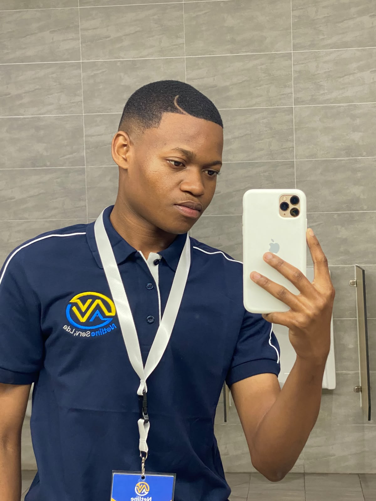
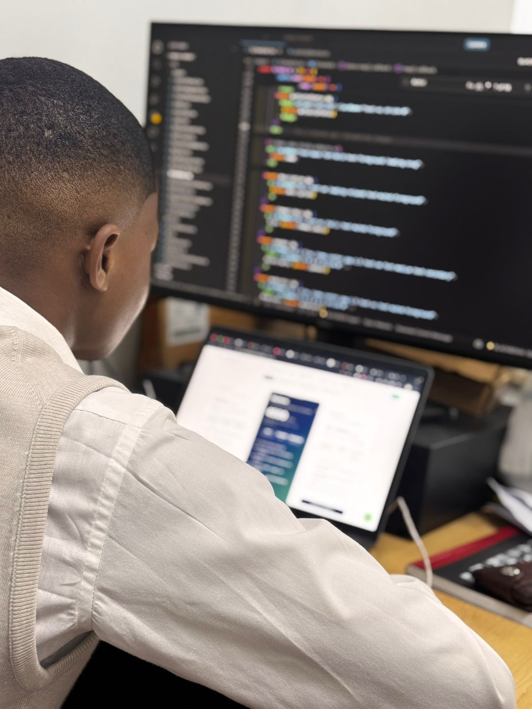
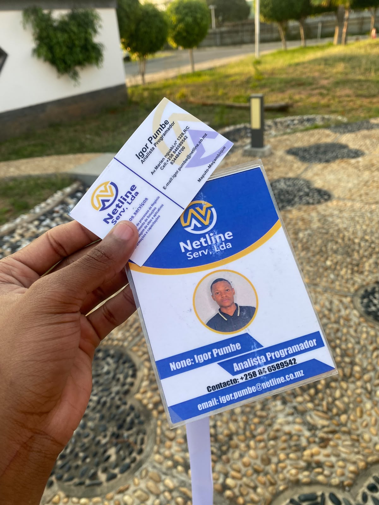

<div align="center">

<!-- Banner -->


<!-- Typing animation -->
<a href="#">
  
</a>

<br/>



<br/>

<!-- Social badges -->
<a href="https://igor-tobias-pumbe.vercel.app/">
  
</a>
<a href="mailto:igortobiaspumbe@gmail.com">
  
</a>
<a href="#">
  
</a>
<a href="#">
  
</a>

</div>

<br/>

## Sobre mim



Desenvolvedor Web **Fullstack** apaixonado por unir interfaces modernas e intuitivas a sistemas backend robustos, seguros e escaláveis. Atualmente construo plataformas institucionais e governamentais em Moçambique, arquiteturando soluções que vão do banco de dados à experiência do utilizador.

```json
{
  "cargo": "Fullstack Web Developer",
  "empresa": "Netline Serv",
  "educacao": "Engenharia Informática @ UEM",
  "foco": ["Arquiteturas Escaláveis", "Clean Code", "Integração de IA"],
  "filosofia": "Aprendizado contínuo, código limpo e software que transforma"
}
```

- **Atuação atual:** arquitetura e desenvolvimento de módulos avançados — moderação de mídia via IA e chat em tempo real — na **Netline Serv**
- **Educação:** Engenharia Informática, *Universidade Eduardo Mondlane (UEM)*
- **Liderança & mentoria:** líder técnico e mentor, com experiência real gerindo equipas e formando novos talentos
- **Filosofia:** aprendizado contínuo, código limpo e sustentável — acredito no poder do software para transformar negócios e vidas

<br clear="right"/>

<br/>

## Stack & Tecnologias

<div align="center">

**Frontend**
<br/>


**Backend & Bases de Dados**
<br/>


**Ferramentas & Workflow**
<br/>


</div>

<details>
<summary><b>Padrões de arquitetura que sigo nos meus projetos</b></summary>
<br/>

- Backends **Java Spring Boot** seguindo **Clean Architecture**, com migrações geridas via **Flyway**
- Frontends **React/TypeScript** com **TanStack Query** e **Jotai** para estado assíncrono e global
- **Tailwind CSS** + **shadcn/ui** para interfaces consistentes e rápidas de construir
- **WordPress** como camada de CMS, com builds React (`dist`) embutidos em temas customizados via `window.WP_DATA`
- Integração de **IA aplicada** a produtos reais: moderação de mídia, assistentes de chat com function calling

</details>

<br/>

## GitHub Stats

<div align="center">


<br/>


</div>

<br/>

## Experiência Profissional



```
2025 — Presente   Desenvolvedor Web Fullstack @ Netline Serv
                   ├─ Arquitetura de soluções com React, TypeScript, Spring Boot e PostgreSQL
                   ├─ Serviço automatizado de moderação de segurança por IA (imagem, vídeo, áudio, texto)
                   └─ Módulo de chat em tempo real com voz, texto e anexos

Set. 2026          Expositor de Soluções Tecnológicas @ Netline Serv (IV CNEAD 2026)
                   └─ Representante oficial no Centro Cultural Moçambique-China (UEM)

2025 — 2026        Mentor & Líder Técnico Frontend @ Iniciativa Própria
                   └─ Programa autoral de mentoria prática no ecossistema JS/TS

2025 — 2026        Supervisor de Equipa @ PumAraujo
                   └─ Liderança direta de 8 colaboradores, gestão operacional e treino contínuo
```

<br clear="right"/>

<br/>

## Projetos em Destaque

<table>
<tr>
<td width="50%" valign="top">

### Plataformas Institucionais
**CFMP** · plataforma governamental de gestão orçamental
`React` `TypeScript` `MUI DataTable` `Tailwind`

**INED/CNEAD** · plataforma LMS multi-institucional e de conferências
`React` `TypeScript` `Spring Boot`

**CNBS Portal** · portal institucional
`React` `TypeScript` `WordPress headless`

</td>
<td width="50%" valign="top">

### Produtos & Gestão
**SIGC** · sistema de cobrança de dívidas com assistente de IA (Groq / Llama 3.3)
`React` `Spring Boot` `IA`

**SPO** · gestão de ciclo orçamental e planeamento
`Spring Boot` `React/TS`

**Campus Market Connect (CMC)** · marketplace universitário com JWT auth
`Spring Boot` `React/TS` `PostgreSQL`

</td>
</tr>
<tr>
<td width="50%" valign="top">

### Sites & Marcas
**Sete Design** · estúdio de design/branding em Maputo
`React` `TypeScript` `Tailwind`

**Ateliê Anuelio Curado** · landing page institucional para alta-costura
`React` `TypeScript` `Tailwind`

**Choupal Auto** · loja de peças automóveis
`React` `TypeScript` `Vite`

</td>
<td width="50%" valign="top">

### IA & Serviços
**AI Moderation Service** · microsserviço de moderação de mídias
`Python` `FastAPI` `NudeNet` `Spring Boot`

**Chuanga Studio** · gestão para salão de beleza
`React` `TypeScript` `Spring Boot`

**Save Segurança** · landing page institucional
`React` `TypeScript` `Tailwind`

</td>
</tr>
</table>

<br/>

## Certificações & Formação

<div align="center">


</div>

<br/>

## Livros que recomendo

> *"Uma parte de tudo o que eu ganhar pertence a mim."*

| Livro | Autor |
|---|---|
| O Homem mais rico da Babilônia | George S. Clason |
| Os Segredos da Mente Milionária | T. Harv Eker |
| Hábitos Atômicos | James Clear |

<br/>

## Vamos conversar

<div align="center">

<a href="mailto:igortobiaspumbe@gmail.com">
  
</a>
<a href="#">
  
</a>
<a href="https://igor-tobias-pumbe.vercel.app/">
  
</a>

<br/><br/>


</div>
